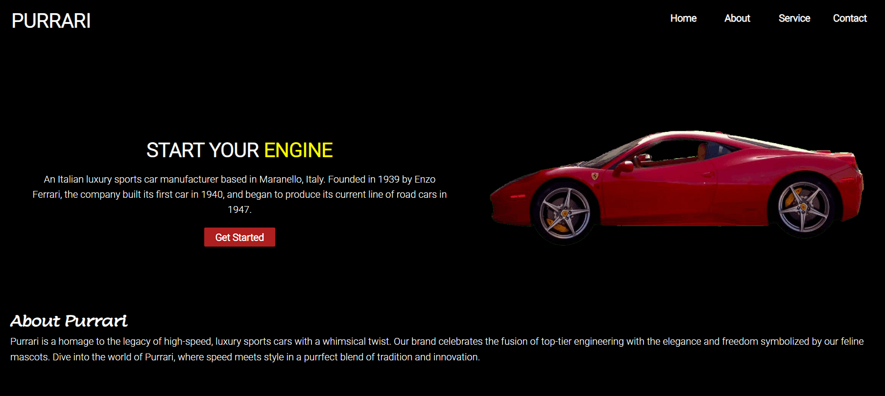

# Purrari - The Essence of Speed and Elegance

Welcome to the repository for Purrari, a website project that celebrates the fusion of top-tier engineering with the elegance and freedom symbolized by our feline muses. Purrari is not just a brand; it's a tribute to the legacy of high-speed, luxury sports cars with a playful twist.

## About Purrari

Purrari is a homage to an Italian luxury sports car manufacturer, reimagined with a whimsical flair. Founded with respect to tradition and a nod to the feline grace, we present a digital space where lovers of speed and style can indulge in the purrfect blend of innovation and heritage.

## Features

- **Responsive Design**: Crafted to provide an immersive experience on all devices. Whether you're on a desktop or on the go, Purrari is at your fingertips.
- **Animation-Driven Interaction**: Engage with elements that come to life as you navigate through the site.
- **Custom Designs**: Tailor your ride with our bespoke design services.
- **Exclusive Events**: Join the family at events where the thrill of the track meets the luxury of camaraderie.

## Technologies Used

- HTML5
- CSS3 with animations and media queries
- FontAwesome for icons
- Google Fonts for typography

## Installation

Clone the repository to your local machine:

Navigate to the project directory:

Open the `index.html` file in your browser to view the project.

## Contributing

We welcome contributions to the Purrari project,for details on how to submit pull requests, the process for submitting bugs, and other ways you can help.
live demo

[demo](https://abishekbalance.github.io/projects.github.io/)

## License

This project is licensed under the [MIT License](LICENSE.md).

## Acknowledgments

- Thanks to Enzo Ferrari for the inspiration behind this creative spin.
- Shoutout to all car enthusiasts and feline aficionados who share our passion.

## Contact

For inquiries, please reach out to contact

We hope you enjoy the ride!

